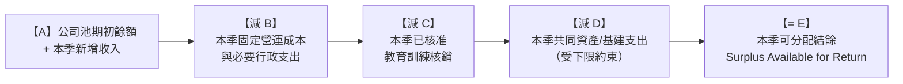

import { Card, CardGrid } from "@astrojs/starlight/components";
import params from "../../../params.json";

## <small>POOL-01</small> 公司池定義 {#pool-01}

公司池係指：依本章程從各案提撥、行政服務費等進入本社之共同資金。

## <small>POOL-02</small> 可用額度與結餘公式 {#pool-02}

每季[公司池](/meta/glossary/#pool)之「可用額度」以以下順序計算：

本季可分配結餘原則應以「回饋勞動」為主要目的，尤其是行政勞務回饋（見 [POOL-04](/bylaws/07-pool/#pool-04)）。

:::note[為什麼要優先回饋勞動？]
公司池來自所有人的共同貢獻，應該優先用於支持「看不見的勞動」（行政、財務、知識管理等），而非只分配給直接產值的專案工作。這是合作社「公平勞動」原則的體現。
:::

## <small>POOL-03</small> 案外資金決策：必須全體討論 {#pool-03}

1. 公司池屬案外資金。任何公司池之制度、用途類別、年度/季度政策、以及超過門檻之支出，須納入勞工大會議程並由全體討論決議（原則共識；必要時依 [GOV-06](/bylaws/03-governance/#gov-06)）。
2. 為確保日常運作，本社可於年度回顧會預先核准「固定營運成本清單」與「共同資產/基建上限」，使其於季度內可按預算執行並於季度回顧會追認。

## <small>POOL-03A</small> 風險準備金：最低保留線 {#pool-03a}

1. 公司池應設置風險準備金，用於壞帳、延遲付款、突發法律/稅務支出、系統性風險事件等。
2. 每季結帳後，風險準備金不得低於以下任一標準（取其高者）：
   - 最近12個月固定營運成本的1季份；或
   - 最近12個月公司池總收入的10%。
3. 若動用風險準備金而低於保留線，須於下一次季度回顧會提出補足計畫（可提高提撥、暫緩回饋、或削減支出）。

---

## <small>POOL-03B</small> 可分配結餘之四種用途 {#pool-03b}

在符合風險準備金保留線的前提下，本季可分配結餘可用於以下四種用途：

<CardGrid>
  <Card title="💰 行政勞務回饋 Administrative Work">
    優先回饗支持組織運作的行政、財務、治理等「看不見的勞動」；採角色點數制，確保所有成員共同承擔組織責任。至少應分配
    {params.POOL_LABOR_RETURN_MIN}。
  </Card>
  <Card title="📚 教育補助 Education & Training">
    支持成員個人發展與學習；採「個人申請、實報實銷、有上限」原則，鼓勵持續學習與知識分享。
  </Card>
  <Card title="🏗️ 共同資產/基建 Assets & Infrastructure">
    投資與維護本社共有之器材、軟體、伺服器等；受上限控制，確保資源配置合理。
  </Card>
  <Card title="💼 投資 Investment">
    用於與本社可持續性、成本下降或公共回報相關之投資；需經大會決議，禁止高投機性投資。
  </Card>
</CardGrid>

:::note[為什麼要分開四種用途？]
不同的分配用途反映了不同的價值優先順序：行政、教育、資產與投資各有不同的目標與決策流程。
清晰的分類幫助成員理解公司池的使用範疇，避免挪作他用，確保資源配置透明與公平。
:::

---

## 💰 行政勞務回饋 Administrative Work

### <small>POOL-04</small> 行政勞務回饋優先 {#pool-04}

1. 在符合 [POOL-03A](/bylaws/07-pool/#pool-03a) 風險保留線之前提下，本季可分配結餘原則上應以行政勞務回饋為主要用途。
2. 行政勞務回饋採角色點數制（見 [POOL-05](/bylaws/07-pool/#pool-05)）。
3. 行政勞務回饋預算規則：
   - 本季可分配結餘中，至少{params.POOL_LABOR_RETURN_MIN}應分配為行政勞務回饲；
   - 若公司池現金流緊縮且需補足風險準備金，該比例得於季度回顧會下修，但不得低於{params.POOL_LABOR_RETURN_CRISIS}。

### <small>POOL-05</small> 角色點數制（點數、任期、交付、扣點） {#pool-05}

#### POOL-05.1 角色與點數配置 {#pool-05-1}

本社每季至少設置下列行政角色；每季點數如下（每季結算一次）：

- 各專案財務（Finance）：1點
- 專案管理（PM / Production）：1點
- 會議主持（Meeting Facilitation）：0.5點
- 紀錄（Documentation）：0.5點
- 制度維護（Policy Maintenance）：0.5點
- 協作管理（Collaboration Management）：0.5點
- 公司資產管理（Asset Management）：0.5點
- 其他（Other Administrative Roles）：0.5點（由大會決議新增或調整）

#### POOL-05.2 任期與輪值 {#pool-05-2}

1. 角色任期原則為一季，可連任；每季開始前於季度回顧會確認角色人選。
2. 同一成員可兼任多角色，但需在會議紀錄中載明，並完成交接要求。
3. 角色空缺時，大會應於{params.COMPLAINT_RESPONSE_DAYS}日內補位；若未補位，該角色點數不發放或由代理人承接。

#### POOL-05.3 最低交付標準 {#pool-05-3}

1. 財務最低交付：收支登帳與憑證整理、季度損益與公司池報表草稿、付款與收款狀態更新（含逾期清單）。
2. PM最低交付：專案排程與里程碑更新、客戶溝通節點紀錄、交付物版本管理與風險提醒。
3. 營運/治理最低交付：會議議程與紀錄（至少季度回顧會）、制度文件維護（章程/流程/模板更新紀錄）、協作與資產管理基本維運（帳號權限、資料夾結構）。

#### POOL-05.4 扣點與取消發放 {#pool-05-4}

1. 未達最低交付標準者，得由勞工大會決議扣減該角色當季點數（扣減幅度20–100%）。
2. 涉及重大疏失者，大會得決議取消該季發放並要求補救。
3. 扳點或取消發放屬公司池分配事項，當事人須回避；原則採共識決，必要時依 [GOV-06](/bylaws/03-governance/#gov-06) {params.CONSENSUS_THRESHOLD}表決。

---

## 📚 教育補助 Education & Training

### <small>POOL-06</small> 教育訓練：個人申請、實報實銷、上限制 {#pool-06}

1. 公司池提供教育訓練支出，採「個人申請、實報實銷、有上限、未申請即不支出」原則。
2. 每位勞工老闆每季可申請之教育訓練核銷上限為，每人可分配得上限不超過當季可分配結餘的5%；且單人單季最高額度由年度回顧會定額公告。
3. 申請需載明用途（課程/書籍/工具）、預算與預期回饋（例如短分享、筆記入庫）；核銷須附憑證。
4. 教育訓練核銷支出須符合公司池用途規定（見 [POOL-03B](/bylaws/07-pool/#pool-03b)），且不得用於與本社業務無關之個人興趣或非專業發展之活動。
5. 教育訓練可核銷之項目包含但不限於：專業課程費用、專業書籍費用、專業工具訂閱費用；但不包含：一般娛樂活動、非專業發展之興趣課程、或與本社業務無關之個人消費，若有爭議由大會決議。

---

## 🏗️ 共同資產/基建 Assets & Infrastructure

### <small>POOL-07</small> 共同資產／基建：上限控制 {#pool-07}

1. 共同資產與基建（器材、軟體長約、字體授權、伺服器等）視為營運成本的一部分，應被控制在合理上限內。
2. 每季共同資產/基建支出不得超過以下任一標準（取其低者）：
   - 當季公司池新增收入的15%；或
   - 當季固定營運成本的30%。
3. 超過上限之購置或訂閱，須經勞工大會以共識決議通過，並提出回收/效益說明與折舊/攤提方式。

---

## 💼 投資 Investment

### <small>POOL-08</small> 投資：限制與程序 {#pool-08}

1. 本社可將公司池的一部分用於投資，但僅限於與本社永續、共同資產、成本下降、或公共回報直接相關之投資。
2. 投資不得使風險準備金低於 [POOL-03A](/bylaws/07-pool/#pool-03a) 保留線，且不得影響固定營運成本之支付能力。
3. 單一投資案須提出：金額、期限、風險、退出條款、最壞情境下的承擔方式，並經勞工大會決議通過。
4. 禁止高投機性或與本社業務無關之投資。
