import { Card, CardGrid } from "@astrojs/starlight/components";
import params from "../../../../params.json";

## <small>POOL-01</small> Common Pool Definition {#pool-01}

The common pool refers to shared funds entering the Co-op from project pool contributions, administrative service fees, and other sources per these bylaws.

## <small>POOL-02</small> Available Balance Formula {#pool-02}

Each quarter's [common pool](/en/meta/glossary/#pool) "available balance" is calculated in the following order:

```mermaid
graph LR
    A["【A】Pool opening balance<br/>+ new revenue this quarter"]
    B["【− B】<br/>Fixed operating costs<br/>and necessary admin expenses"]
    C["【− C】<br/>Approved education/training<br/>reimbursements this quarter"]
    D["【− D】<br/>Common assets/infrastructure<br/>spending this quarter<br/>(subject to ceiling)"]
    E["【= E】<br/>Surplus Available for Return<br/>this quarter"]

    A --> B --> C --> D --> E
```

The quarterly surplus available for return shall in principle be directed primarily toward **labor returns**, especially administrative labor returns (see POOL-04).

:::note[Why prioritize labor returns?]
The common pool comes from everyone's shared contributions and should first support "invisible labor" (admin, finance, knowledge management, etc.), not only direct project work. This is the cooperative principle of fair labor in action.
:::

## <small>POOL-03</small> Pool-level Financial Decisions: Full Discussion Required {#pool-03}

1. The common pool consists of pool-level funds. Any pool policy, category of use, annual/quarterly policy, or expenditure above threshold must be placed on the General Assembly agenda and decided by full discussion (consensus in principle; voting per GOV-06 if necessary).
2. To ensure daily operations, the Co-op may pre-approve a "fixed operating cost list" and "common assets/infrastructure ceiling" at the annual review meeting, allowing execution within budget during the quarter and ratification at the quarterly review meeting.

## <small>POOL-03A</small> Risk Reserve: Minimum Retention Line {#pool-03a}

1. The common pool shall maintain a risk reserve for bad debts, delayed payments, unexpected legal/tax expenses, and systemic risk events.
2. After each quarter-end closing, the risk reserve must not fall below the higher of:
   - 1 quarter of fixed operating costs over the past 12 months; or
   - 10% of total common pool revenue over the past 12 months.
3. If the risk reserve falls below the retention line due to drawdown, a replenishment plan must be presented at the next quarterly review meeting (by increasing contributions, deferring returns, or cutting expenses).

---

## <small>POOL-03B</small> Four Uses for the Quarterly Surplus {#pool-03b}

Subject to maintaining the risk reserve retention line, the quarterly surplus available for return may be used for the following four purposes:

<CardGrid>
  <Card title="💰 Administrative Labor Returns">
    Priority return for "invisible labor" supporting organizational operations —
    admin, finance, governance, etc.; uses the role point system to ensure all
    members share organizational responsibility. At least{" "}
    {params.POOL_LABOR_RETURN_MIN} must be allocated.
  </Card>
  <Card title="📚 Education & Training">
    Supports member personal development and learning. Uses "individual
    application, reimbursement-based, with ceiling" principle to encourage
    continuous learning and knowledge sharing.
  </Card>
  <Card title="🏗️ Common Assets & Infrastructure">
    Investment in and maintenance of Co-op shared equipment, software, servers,
    etc. Subject to ceilings to ensure reasonable resource allocation.
  </Card>
  <Card title="💼 Investment">
    For investments directly related to Co-op sustainability, cost reduction, or
    public benefit returns. Requires General Assembly resolution; speculative
    investments prohibited.
  </Card>
</CardGrid>

:::note[Why separate four uses?]
Different uses reflect different value priorities — admin, education, assets, and investment each have different goals and decision processes. Clear categorization helps members understand the scope of pool use, prevents misappropriation, and ensures transparent and fair resource allocation.
:::

---

## 💰 Administrative Labor Returns

### <small>POOL-04</small> Administrative Labor Returns: Priority Use {#pool-04}

1. Subject to the POOL-03A risk retention line, the quarterly surplus shall in principle prioritize administrative labor returns.
2. Administrative labor returns use the role point system (see POOL-05).
3. Administrative labor return budget rules:
   - At least {params.POOL_LABOR_RETURN_MIN} of the quarterly surplus shall be allocated as administrative labor returns.
   - If cash flow is constrained and the risk reserve needs replenishment, this ratio may be reduced at the quarterly review meeting, but not below {params.POOL_LABOR_RETURN_CRISIS}.

### <small>POOL-05</small> Role Point System {#pool-05}

#### POOL-05.1 Roles & Point Allocation {#pool-05-1}

The Co-op establishes at least the following administrative roles each quarter; points per quarter (settled quarterly):

- Project Finance: 1 point
- Project Management (PM / Production): 1 point
- Meeting Facilitation: 0.5 points
- Documentation: 0.5 points
- Policy Maintenance: 0.5 points
- Collaboration Management: 0.5 points
- Asset Management: 0.5 points
- Other Administrative Roles: 0.5 points (added or adjusted by General Assembly resolution)

#### POOL-05.2 Term & Rotation {#pool-05-2}

1. Role terms are in principle one quarter; re-appointment is permitted. Role assignments are confirmed at the quarterly review meeting before each quarter begins.
2. A single member may hold multiple roles, but this must be recorded in meeting minutes with handover requirements completed.
3. When a role is vacant, the General Assembly shall fill it within {params.COMPLAINT_RESPONSE_DAYS} days. If unfilled, the role's points are not issued or are assumed by an acting member.

#### POOL-05.3 Minimum Delivery Standards {#pool-05-3}

1. Finance minimum delivery: income/expense entry and receipt organization, draft quarterly P&L and common pool report, payment and receivable status update (including overdue list).
2. PM minimum delivery: project schedule and milestone updates, client communication touchpoint records, deliverable version management and risk alerts.
3. Operations/governance minimum delivery: meeting agenda and minutes (at minimum quarterly review meeting), policy document maintenance (bylaws/workflow/template update records), basic collaboration and asset management operations (account permissions, folder structure).

#### POOL-05.4 Point Deductions & Cancellation {#pool-05-4}

1. If minimum delivery standards are not met, the General Assembly may resolve to reduce that role's points for the quarter (reduction of 20–100%).
2. For significant negligence, the General Assembly may resolve to cancel the quarter's issuance and require remediation.
3. Point deductions or cancellations are pool distribution matters; the party involved must recuse. Consensus in principle; if necessary, vote per GOV-06 at {params.CONSENSUS_THRESHOLD}.

---

## 📚 Education & Training

### <small>POOL-06</small> Education & Training: Individual Application, Reimbursement-based, With Ceiling {#pool-06}

1. The common pool provides education and training reimbursements, using an "individual application, reimbursement-based, with ceiling, no payout without application" principle.
2. Each worker-owner may apply for education and training reimbursement up to 5% of the quarterly surplus available per person per quarter; and the maximum per person per quarter is announced at the annual review meeting.
3. Applications must state the purpose (course/book/tool), budget, and expected return (e.g., a short sharing session, notes filed). Reimbursement requires receipts.
4. Education and training reimbursements must comply with common pool use rules (see POOL-03B) and may not be used for personal hobbies or non-professional development activities unrelated to Co-op business.
5. Reimbursable items include but are not limited to: professional course fees, professional book fees, professional tool subscription fees. Not reimbursable: general entertainment, hobby courses unrelated to professional development, or personal consumption unrelated to Co-op business. Disputes are resolved by the General Assembly.

---

## 🏗️ Common Assets & Infrastructure

### <small>POOL-07</small> Common Assets & Infrastructure: Ceiling Control {#pool-07}

1. Common assets and infrastructure (equipment, long-term software subscriptions, font licenses, servers, etc.) are treated as part of operating costs and shall be kept within a reasonable ceiling.
2. Quarterly common assets/infrastructure expenditure may not exceed the lower of:
   - 15% of new common pool revenue that quarter; or
   - 30% of fixed operating costs that quarter.
3. Purchases or subscriptions exceeding the ceiling require a General Assembly consensus resolution with a recovery/benefit explanation and depreciation/amortization method.

---

## 💼 Investment

### <small>POOL-08</small> Investment: Restrictions & Procedure {#pool-08}

1. The Co-op may invest a portion of the common pool, but only in investments directly related to Co-op sustainability, common assets, cost reduction, or public benefit returns.
2. Investments must not reduce the risk reserve below the POOL-03A retention line or affect the ability to pay fixed operating costs.
3. Each investment proposal must include: amount, term, risk, exit clauses, and worst-case scenario liability, and must be approved by General Assembly resolution.
4. Highly speculative investments or investments unrelated to Co-op business are prohibited.
